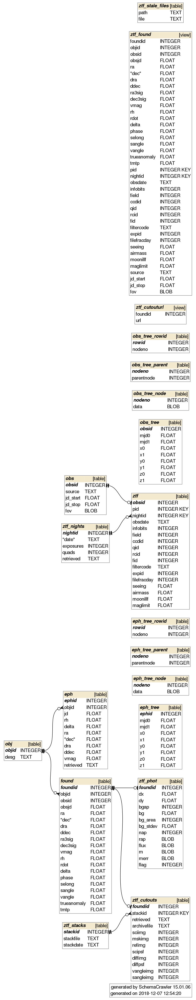

# ZChecker v2.3.3
ZTF moving target checker for short object lists.

## Attribution and license
Written by Michael S. P. Kelley (University of Maryland), with contributions from Quan-Zhi Ye (IPAC/Caltech).  Thanks to James Bauer, Dennis Bodewits, Tony Farnham, and Matthew Knight for some design comments.

If `ZChecker` is useful to you, please cite Kelley, M. S. P., Bodewits, D., Ye, Q. et al. 2019.  ADASS XXVIII, ed. P. Teuben, M. Pound, B. Thomas, andE. Warner, ASP Conf. Ser., in press.

ZChecker is licensed with the BSD 3-clause license.  See LICENSE for details.

## Acknowledgements

Support for ZChecker was provided by the NASA/University of Maryland/Minor Planet Center Augmentation through the NASA Planetary Data System Cooperative Agreement NNX16AB16A, and by the NASA Near-Earth Objects Observations grant NNX15AD99G.

## Requirements
* Python 3.5+
* astropy v2.0+
* [sbsearch v0.1](https://github.com/Small-Bodies-Node/sbsearch/tree/v0.1)
* [sbpy](https://github.com/NASA-Planetary-Science/sbpy) current dev version
* requests
* astroquery 0.3.9
* sqlite
* wget

### Optional packages
* Montage and montage_wrapper, optional, for image reprojection with ``zproject``
* [oorb](https://github.com/oorb/oorb) and its Python wrapper for Minor Planet Center Possible Comet Confirmation Page (PCCP) checking
* photutils 0.5+ for measuring photometry with ``zphot``

## Configuration

Create a file with your preferred locations for the database, log
file, etc. in `~/.config/zchecker.config`.  To see the file format and
current allowed configuration parameters::

  ```
$ zchecker --help
  
...
{
  "database": "/path/to/zchecker.db",
  "log": "/path/to/zchecker.log",
  "user": "IRSA account user name",
  "password": "IRSA account password",
  "cutout path": "/path/to/cutout/directory",
  "cutout size": "5arcmin",
  "stack path": "/path/to/stack/directory"
}

```

## Ephemerides

1. (Optional) Make a list of objects: `objects.list`.

1. Update local database with ephemerides, specifying objects through
   the list or on the command line::

     `zchecker eph-update objects.list --start=YYYY-MM-DD --stop=YYYY-MM-DD` 

     `zchecker eph-update "C/2017 Y1, C/2017 Y2" --start=YYYY-MM-DD --stop=YYYY-MM-DD`

   Broad date ranges are best.  Ephemerides can be updated as the
   orbital elements are refined.

1. Delete ephemerides from the database::

     `zchecker eph-update --clean objects.list`
     
     `zchecker eph-update --clean objects.list --start=YYYY-MM-DD --stop=YYYY-MM-DD` 
     
     `zchecker eph-update --clean "C/2017 Y1, C/2017 Y2" --start=YYYY-MM-DD --stop=YYYY-MM-DD`


## Usage

1. Update local database with ZTF observations from a single night::

     `zchecker ztf-update --date=YYYY-MM-DD`
   
   Over a range of nights:
   
     `zchecker ztf-update --start=YYYY-MM-DD --stop=YYYY-MM-DD`

   Or to simply check the last night::
	
     `zchecker ztf-update`

1. Summarize nights in the local database::

     `zchecker list-nights`

1. Find observations of your targets from the last night::

     `zchecker search`

   For a specific date::

     `zchecker search --date=YYYY-MM-DD`
	
   Over a range of dates::
	
     `zchecker search --start=YYYY-MM-DD --stop=YYYY-MM-DD`

   For all dates in the local database::

     `zchecker search --full`
	
   For a subset of targets saved to the file `subset.list`::

     `zchecker search subset.list --full`
	
   For a subset of targets specified on the command line::

     `zchecker search "C/2017 AB5" --full`
     
     `zchecker search "C/2017 Y1,C/2017 Y2" --full`

   Using a different V magnitude limit::

     `zchecker search "C/2017 Y1,C/2017 Y2" --full --vmax=18`

1. Report previously found objects::

     `zchecker list-found "C/2017 Y1,C/2017 Y2"`
	 
   For a specific date / date range::
   
     `zchecker list-found --date=2018-11-01`
	 
     `zchecker list-found --start=2018-11-01 --stop=2018-11-12`

1. Clean the found object database and associated cutout files, if they exist::

     `zchecker clean-found "C/2017 AB5"`
     
     `zchecker clean-found "C/2017 AB5" --start=YYYY-MM-DD --stop=YYYY-MM-DD`

1. Download cutouts around each found target::

     `zchecker download-cutouts`
	 
   For specific targets::
   
     `zchecker download-cutouts "C/2017 Y1,C/2017 Y2"`
	 
   Use a different size::
   
     `zchecker download-cutouts 6478 --size=20arcmin`

1. ZChecker's database tracks files that have been downloaded, but accidents (and bugs) can happen.  If so, verify and fix the downloaded file repository with::

     `zchecker download-cutouts 'P/2011 S1' --missing`

1. Reproject downloaded cutouts to align projected velocity vectors and comet-Sun vectors along the +x axis::

     `zproject`
	 
   Use a different size::
   
     `zproject --size=20arcmin`
	 
1. Make nightly and bi-weekly stacks by object::

     `zstack`

   Check integrity of stack archive and fix errors::

     `zstack --clean-missing`
	 
1. Experimental: measure object photometry::

     `zphot`


## Image data

### Cutouts

Cutouts around each object are downloaded to the cutouts directory
specified in the configuration.  Files are sorted into sub-directories
by object name.  Cutout file names are lower-case with the format:
`desg-yyyymmdd_hhmmss-rh-ztf.fits`, where rh is the heliocentric
distance with the prefix 'pre' or 'post' depending on which side of
perihelion it is on (based on heliocentric radial velocity).

The FITS file format for cutouts:

| Extension name | HDU type | Source   | Description                                               |
|----------------|----------|----------|-----------------------------------------------------------|
| SCI            | Primary  | IRSA     | Original science data cutout                              |
| MASK           | Image    | IRSA     | Source mask                                               |
| PSF            | Image    | IRSA     | Science image point source function                       |
| DIFF           | Image    | IRSA     | Reference subtracted image cutout                         |
| REF            | Image    | IRSA     | Reference image cutout                                    |
| SANGLE         | Image    | zproject | Science or diff image aligned with projected Sun vector   |
| SANGLEMASK     | Image    | zproject | Source mask for SANGLE                                    |
| SANGLEREF      | Image    | zproject | Reference image aligned with projected Sun vector         |

If the SANGLE image is based on DIFF, the SANGLE extension header
keyword DIFFIMG will be True.

### Stacks

Stack files are downloaded to the stacks directory specified in the
configuration, organized by object name.  File names are lower-case
with the format: `desg-yyyymmdd-rh-ztf-stack.fits`:

| Extension name | HDU type | Source | Description                                            |
|----------------|----------|--------|--------------------------------------------------------|
| PRIMARY        | Primary  | IRSA   | Original science data header                           |
| COMA           | Image    | zstack | Nightly stack of SANGLE data using coma model          |
| COMA REF       | Image    | zstack | Nightly stack of SANGLEREF data using coma model       |
| COMA BL        | Image    | zstack | Baseline image from SANGLE data using coma model       |
| COMA REF BL    | Image    | zstack | Baseline image from SANGLEREF data using coma model    |
| SURF           | Image    | zstack | Nightly stack of SANGLE data using surface model       |
| SURF REF       | Image    | zstack | Nightly stack of SANGLEREF data using surface model    |
| SURF BL        | Image    | zstack | Baseline image from SANGLE data using surface model    |
| SURF REF BL    | Image    | zstack | Baseline image from SANGLEREF data using surface model |

The coma model is $r_h^{-4} \Delta^{-1}$ and the surface model
$r_h^{-2} \Delta^{-2}$.

## Database

### `nights`

Summary of ZTF observations by night, as downloaded from IRSA.

| Column    | Type    | Source   | Description               |
|-----------|---------|----------|---------------------------|
| nightid   | integer | zchecker | unique night identifier   |
| date      | text    | user     | UT date                   |
| exposures | integer | IRSA     | number of exposures       |
| quads     | integer | IRSA     | number of image quadrants |


### `obj`

Objects.

| Column | Type    | Source   | Description              |
|--------|---------|----------|--------------------------|
| objid  | integer | zchecker | unique object identifier |
| desg   | text    | user     | target designation       |

### `eph`

Object ephemerides.  The default time step is 1/day, with smaller time
steps for objects closer to the Earth.

| Column    | Type    | Source   | Description                                                   |
|-----------|---------|----------|---------------------------------------------------------------|
| ephid     | integer | zchecker | unique ephemeris identifier                                   |
| objid     | integer | zchecker | unique object identifier from `obj` table                     |
| jd        | float   | zchecker | ephemeris epoch (Julian date)                                 |
| rh        | float   | JPL/MPC  | heliocentric distance (au)                                    |
| delta     | float   | JPL/MPC  | observer-target distance (au)                                 |
| ra        | float   | JPL/MPC  | Right Ascension (radians)                                     |
| dec       | float   | JPL/MPC  | Declination (radians)                                         |
| dra       | float   | JPL/MPC  | Right Ascension * cos(Declination) rate of change (arcsec/hr) |
| ddec      | float   | JPL/MPC  | Declination rate of change (arcsec/hr)                        |
| vmag      | float   | JPL/MPC  | brightness estimate (magnitude)                               |
| retrieved | text    | zchecker | date of ephemeris retrieval                                   |


### `eph_tree`

R-tree of object ephemerides.

| Column | Type    | Source   | Description                                                      |
|--------|---------|----------|------------------------------------------------------------------|
| ephid  | integer | zchecker | unique ephemeris identifier from `eph` table                     |
| mjd0   | float   | zchecker | time bounding box (modified Julian date)                         |
| mjd1   | float   | zchecker |                                                                  |
| x0     | float   | zchecker | spatial bounding box in Cartesian coordinates on the unit sphere |
| x1     | float   | zchecker |                                                                  |
| y0     | float   | zchecker |                                                                  |
| y1     | float   | zchecker |                                                                  |
| z0     | float   | zchecker |                                                                  |
| z1     | float   | zchecker |                                                                  |

### `obs`

Basic observation parameters.

| Column   | Type    | Source   | Description                             |
|----------|---------|----------|-----------------------------------------|
| obsid    | integer | zchecker | unique observation identifier           |
| source   | text    | zchecker | data source (ztf)                       |
| jd_start | float   | IRSA     | exposure start time                     |
| jd_stop  | float   | zchecker | exposure stop time (jd_start + exptime) |
| fov      | blob    | IRSA     | ra, dec of center and four corners      |

### `obs_tree`

R-tree of observations.

| Column | Type    | Source   | Description                                                      |
|--------|---------|----------|------------------------------------------------------------------|
| obsid  | integer | zchecker | unique observation identifier from `obs` table                   |
| mjd0   | float   | zchecker | time bounding box (modified Julian date)                         |
| mjd1   | float   | zchecker |                                                                  |
| x0     | float   | zchecker | spatial bounding box in Cartesian coordinates on the unit sphere |
| x1     | float   | zchecker |                                                                  |
| y0     | float   | zchecker |                                                                  |
| y1     | float   | zchecker |                                                                  |
| z0     | float   | zchecker |                                                                  |
| z1     | float   | zchecker |                                                                  |


### `ztf`

ZTF observation metadata.

| Column      | Type    | Source   | Description                                                              |
|-------------|---------|----------|--------------------------------------------------------------------------|
| obsid       | integer | zchecker | unique observation identifier from `obs` table                           |
| pid         | integer | ZTF      | science product ID, unique                                               |
| obsdate     | text    | zchecker | observation mid-time (UT)                                                |
| infobits    | integer | ZTF      | info bit flags, see Section 10.4 of the [ZTF Science Data System][1]     |
| field       | integer | ZTF      | ZTF field number                                                         |
| ccdid       | integer | ZTF      | detector chip ID (1, ...16), see Fig. 1 of [ZTF Science Data System][1]  |
| qid         | integer | ZTF      | CCD quadrant ID (1, 2, 3, 4), see Fig. 1 of [ZTF Science Data System][1] |
| rcid        | integer | ZTF      | readout channel ID (0, ...63)                                            |
| fid         | integer | ZTF      | filter ID                                                                |
| filtercode  | text    | ZTF      | abbreviated filter name: zr, zg, zi                                      |
| expid       | integer | ZTF      | exposure ID                                                              |
| filefracday | integer | ZTF      | fractional time of day of exposure (UT)                                  |
| seeing      | float   | ZTF      | seeing FWHM (arcsec)                                                     |
| airmass     | float   | ZTF      | telescope airmass                                                        |
| moonillf    | float   | ZTF      | Moon illuminated fraction                                                |
| maglimit    | float   | ZTF      | magnitude limit                                                          |

[1]: http://web.ipac.caltech.edu/staff/fmasci/ztf/ztf_pipelines_deliverables.pdf

### `found`

Found objects and observation geometry at image mid-time.

| Column      | Type    | Source   | Description                                                     |
|-------------|---------|----------|-----------------------------------------------------------------|
| foundid     | integer | zchecker | unique identifier                                               |
| objid       | integer | zchecker | unique object identifier from `obj` table                       |
| obsid       | integer | zchecker | unique observation identifier from `obs` table                  |
| obsjd       | float   | zchecker | mid-point of the observation and epoch for ephemeris            |
| ra          | float   | JPL      | Right Ascension (degrees)                                       |
| dec         | float   | JPL      | Declination (degrees)                                           |
| dra         | float   | JPL      | Right Ascension * cos(Declination) rate of change (arcsec/hr)   |
| ddec        | float   | JPL      | Declination rate of change (arcsec/hr)                          |
| ra3sig      | float   | JPL      | Right Ascension 3σ uncertainty (arcsec)                         |
| dec3sig     | float   | JPL      | Declination 3σ uncertainty (arcsec)                             |
| vmag        | float   | JPL      | brightness estimate (magnitude)                                 |
| rh          | float   | JPL      | heliocentric distance (au)                                      |
| rdot        | float   | JPL      | heliocentric distance rate of change (km/s)                     |
| delta       | float   | JPL      | observer-target distance (au)                                   |
| phase       | float   | JPL      | phase angle (degrees)                                           |
| selong      | float   | JPL      | solar elongation (degrees)                                      |
| sangle      | float   | JPL      | projected comet-sun vector position angle (degrees E of N)      |
| vangle      | float   | JPL      | projected comet velocity vector position angle (degrees E of N) |
| trueanomaly | float   | HORIZONS | true anomaly based on osculating elements (degrees)             |
| tmtp        | float   | HORIZONS | T-Tp, time from perihelion, based on osculating elements (days) |

### `ztf_cutouts`

| Column      | Type    | Source   | Description                                          |
|-------------|---------|----------|------------------------------------------------------|
| foundid     | integer | zchecker | unique identifier from `found` table                 |
| stackid     | integer | zchecker | unique identifier from `ztf_stacks` table            |
| retrieved   | text    | zchecker | date cutout was downloaded                           |
| archivefile | text    | zchecker | file name                                            |
| sciimg      | integer | zchecker | flag for science image presence                      |
| mskimg      | integer | zchecker | flag for mask image                                  |
| refimg      | integer | zchecker | flag for reference image                             |
| scipsf      | integer | zchecker | flag for science image PSF                           |
| diffimg     | integer | zchecker | flag for difference image                            |
| diffpsf     | integer | zchecker | flag for difference image PSF                        |
| vangleimg   | integer | zchecker | flag for projected image aligned with velocity angle |
| sangleimg   | integer | zchecker | flag for projected image aligned with sun angle      |

### `ztf_stacks`

| Column    | Type    | Source   | Description           |
|-----------|---------|----------|-----------------------|
| stackid   | integer | zchecker | unique identifier     |
| stackfile | text    | zchecker | file name             |
| stackdate | text    | zchecker | date data was stacked |

There is a one-to-many mapping of stackid to foundid that should be
preserved upon multiple runs of ``zstack``.

### `ztf_phot`

| Column   | Type    | Source   | Description                                                   |
|----------|---------|----------|---------------------------------------------------------------|
| foundid  | integer | zchecker | unique identifier from `found` table                          |
| dx       | float   | zchecker | centroid x offset from ephemeris position (pixel)             |
| dy       | float   | zchecker | centroid y offset from ephemeris position (pixel)             |
| bgap     | integer | zchecker | presently unused                                              |
| bg       | float   | zchecker | estimated background (ADU/pixel)                              |
| bg_area  | integer | zchecker | number of pixels used to estimate background                  |
| bg_stdev | float   | zchecker | standard deviation of background values (ADU)                 |
| nap      | integer | zchecker | number of apertures                                           |
| rap      | blob    | zchecker | source aperture radii (pixels)                                |
| flux     | blob    | zchecker | background subtracted source flux in circular apertures (ADU) |
| m        | blob    | zchecker | calibrated magnitude for each aperture                        |
| merr     | blob    | zchecker | estimated uncertainty on m                                    |
| flag     | integer | zchecker | quality and error flags                                       |

rap is an array of short integers, flux, m, and merr are arrays of
single-precision floats.

Photometry flags:

| Bit | Description                         |
|-----|-------------------------------------|
| 0   | Centroid failure                    |
| 1   | Large centroid offset               |
| 2   | Large estimated background aperture |
| 4   | Not background subtracted           |


### Schema summary


